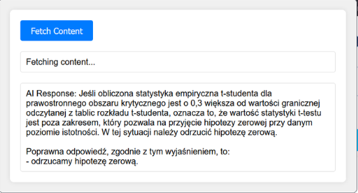

# WSB-ai-solver

## About the project
**WSB-ai-solver** is a Firefox browser extension which allows to automatically copy the question and given answers from the current online test from <a href="https://clouda.edu.pl">Clouda</a>
and generate AI result.



## Installation
1. Clone this repository
```bash
git clone https://github.com/DEENUU1/WSB-ai-solver.git
```
2. Add OpenAI API KEY in `popup.js` file in line 71
```javascript
    return fetch(endpoint, {
        method: 'POST',
        headers: {
            'Content-Type': 'application/json',
            'Authorization': `Bearer sk-proj-...`
        },
        body: JSON.stringify(requestData)
```
3. Open Firefox and go to <a href="about:debugging">about:debugging</a>
4. Click on _Ten Firefox_ (This Firefox)
5. Add temporary extension and select `manifest.json` file from this repository